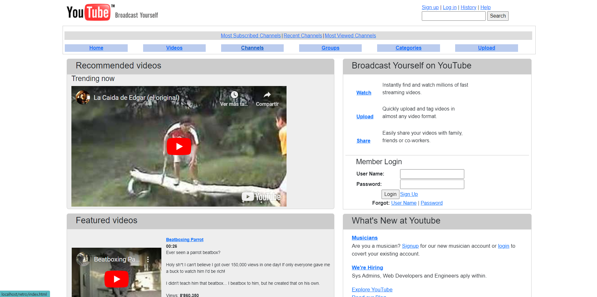
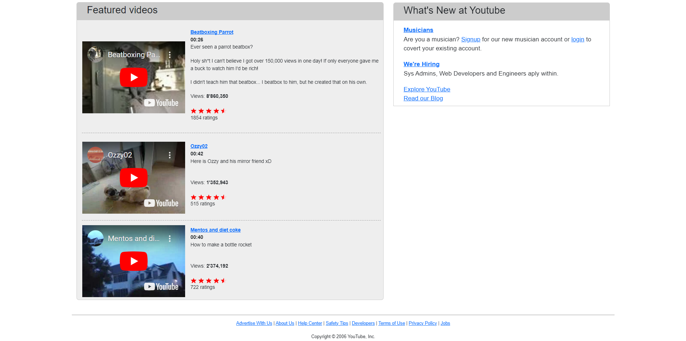

# Youtube 2006 Replica

This is a replica of how Youtube index page looked like back in 2006. The website has been recreated using HTML, CSS, and Bootstrap, and functionality has been added with JavaScript, jQuery, and AJAX.

This is a homework of the `Software Construction` class.

